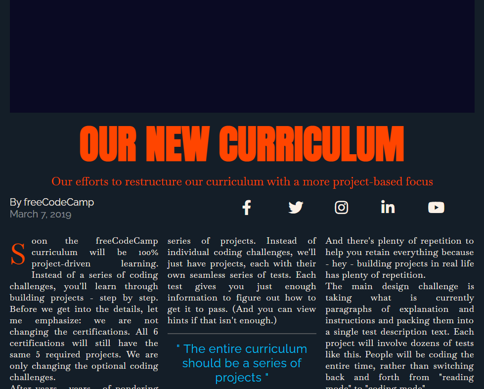

# responsive-web-design
<!DOCTYPE html>
<html>
  <head>
    <meta name="viewport" content="width=device-width, initial-scale=1.0" />
    <meta charset="utf-8" />
    <title>Personal Portfolio Webpage</title>
    <link
      rel="stylesheet"
      type="text/css"
      href="./PersonalPortfolioWebpageStyles.css"
    />
    <link
      rel="stylesheet"
      href="https://use.fontawesome.com/releases/v5.8.2/css/all.css"
    />
  </head>
  <body>
    <header id="navbar">
      <nav id="nav-bar">
        <a href="#welcome-section">About</a>
        <a href="#projects">Work</a>
        <a href="#contact">Contact</a>
      </nav>
    </header>
    <section id="welcome-section">
      <h1>Hey! I am Joy</h1>
      
an aspiring web developer

    </section>
    <section id="projects">
      <h2>These are some of my projects</h2>
      

      

        <a href="./Product Landing.html">
          
          
Product Landing Page

        </a>
        <a href="./Technical Documentation Page.html">
          
          
Technical Documentation Page

        </a>
        <a href="./Survey Form.html">
          
          
Survey Form

        </a>
        <a href="./Tribute.html">
          
          
Tribute Page

        </a>
        <a href="./Magazine.html">
          
          
Magazine

        </a>
        <a href="./City Skyline.html">
          
          
City Skyline

        </a>
      

      <a class="show-all" href="./Cafe Menu.html"><button type="button">Show All ></button></a>
    </section>
    <section id="contact">
      <h1>Let's work together...</h1>
      
How do you take your coffee?

      

        <a id="profile-link" target="_blank" href="https://www.facebook.com/justliguyuh/">
          <i class="fab fa-facebook-square"></i>
          
Facebook

        </a>
        <a id="profile-link" target="_blank" href="https://github.com/justliguyuh">
          <i class="fab fa-github"></i>
          
GitHub

        </a>
        <a id="profile-link" target="_blank" href="https://twitter.com/justliguyuh">
          <i class="fab fa-twitter"></i>
          
Twitter

        </a>
        <a id="profile-link" target="_blank" href="https://www.linkedin.com/in/joy-alecha-0b53b91aa/">
          <i class="fab fa-linkedin-in"></i>
          
LinkedIn

        </a>
        <a id="profile-link" target="_blank" href="mailto: joy.alecha15@gmail.com">
          <i class="fa fa-at"></i>
          
Send an email

        </a>
        <a id="profile-link" target="_blank" href="tel: 09294098863">
          <i class="fa fa-mobile"></i>
          
Call me

        </a>
      

      

      <footer>
        
**All the projects are lessons from freeCodeCamp I have taken.

        

          <i class="fa fa-copyright"></i> Created for freeCodeCamp (<i
            class="fa fa-fire"
          ></i
          >)
        

      </footer>
    </section>
  </body>
</html>
